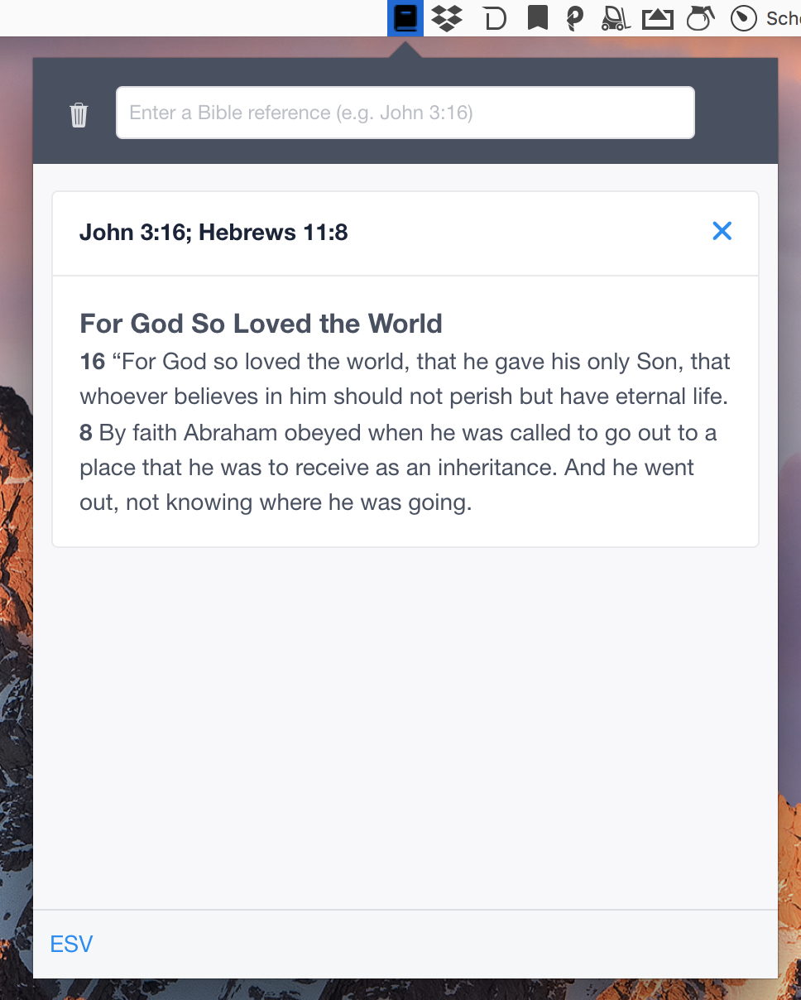

# Bible Helper

A simple scripture reference lookup tool

Keyboard shortcut: `Command+Shift+E`



[DOWNLOAD](https://github.com/genu/bible-helper/releases/download/v1.0.2/bible-helper.dmg) (MAC)


## Developing

``` bash
# install dependencies
yarn install
```
This project uses [ESV API](https://api.esv.org/) under the hood. You must register for an api authentication token in order to run locally.

Once you get a Auth token, you must create a local config file in `server/config/local.js` (Don't worry, this file is ignored by git) with the following contents:

```javascript
module.exports = {
  token: 'YOUR_TOKEN'
};

```


```bash
# Run the server and app in development mode
yarn run dev
```

### Building a binary
``` bash
# Build the app and create a release in the /releases folder
yarn run build
